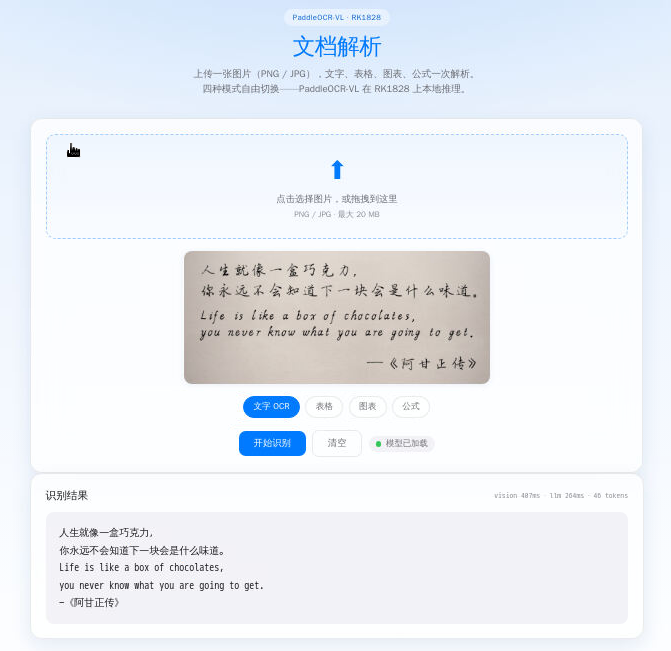

<div align="center">

# RK1828 ModelHub

**中文** | [English](README_EN.md)

模型全部在板端 NPU 上推理，浏览器就是操作界面。


</div>

## 项目简介

一套跑在 **RK1828 NPU 板卡**上的大模型 demo 合集，覆盖语音、视觉、文档解析等常见场景。模型全部在板端 NPU 上本地推理，浏览器就是操作界面，日常使用不用碰命令行。

- **硬件**：RK1828 NPU + RK3588；更多信息详见 <https://www.shimetapi.cn/>。
- **定位**：给板子配套的一键部署演示集——`sh deploy.sh` 拉模型、`sh start.sh` 起服务，开箱即用。
- **模型转换**：模型先用 [RKNN-Toolkit3](https://github.com/airockchip/rknn-toolkit3) 转成 `.rknn`，再参照官方 [rknn3-model-zoo](https://github.com/airockchip/rknn3-model-zoo) 的示例移植成 C++ 引擎，跑在 RKNPU 上。

## Demo 列表

涵盖 LLM、VL、TTS… 等多种模型，一键部署，demo 详情如下：

<table>
<tr>
<td width="50%" align="center" valign="top">

### 💬 聊天


MiniCPM5-2B，W4A16 / W8A16 在线切换，流式输出。

实测 **105 token/s**（W4） / **70 token/s**（W8）

**[→ chat/README.md](chat/README.md)**

</td>
<td width="50%" align="center" valign="top">

### 📷 视频问答


Qwen2.5-VL-3B 多模态，接 USB 摄像头，对着实时画面提问。

问一句 **1 秒内**出答案

**[→ vl/README.md](vl/README.md)**

</td>
</tr>
<tr>
<td width="50%" align="center" valign="top">

### 🔊 语音合成


Qwen3-TTS-12Hz-1.7B，输入文字合成语音，自然语言控语气 + 9 音色切换。

一句 **1~4 秒**出语音

**[→ tts/README.md](tts/README.md)**

</td>
<td width="50%" align="center" valign="top">

### 📝 语音字幕


Qwen3-ASR，麦克风录音或上传音频，转写过程逐轮流式出字幕。

15 秒音频 **几秒**转完

**[→ asr/README.md](asr/README.md)**

</td>
</tr>
<tr>
<td width="50%" align="center" valign="top">

### 📏 深度相机


Depth-Anything-V3，拍一张出「原图 vs 深度图」。

一张 **0.2 秒**出深度

**[→ depth/README.md](depth/README.md)**

</td>
<td width="50%" align="center" valign="top">

### 🎯 实时识别


YOLO26n **检测 / 分割 / 姿态**三页签一键切换。

实时 **14 FPS**（NPU 单帧 12~15ms）

**[→ yolo26/README.md](yolo26/README.md)**

</td>
</tr>
<tr>
<td width="50%" align="center" valign="top">

### 📄 文档解析



PaddleOCR-VL 多模态 OCR，文字 / 表格 / 图表 / 公式四种模式一键切换，表格和图表直接还原成结构数据。

一张 **1~2 秒**出结果

**[→ paddleocr_vl/README.md](paddleocr_vl/README.md)**

</td>
<td width="50%" align="center" valign="middle">

未完待续...

</td>
</tr>
</table>

## 怎么跑

七个 demo 套路一样，四步：**拿代码 → 进目录 → 拉模型 → 启动**。

```bash
git clone https://github.com/ShiMetaPi/rk1828-modelhub.git   # 或 Gitee（国内快）
cd rk1828-modelhub/<demo 目录>                              # chat / vl / tts / asr / depth / yolo26 / paddleocr_vl
sh deploy.sh                                                # 只拉这个 demo 需要的模型
sh start.sh                                                 # 起网页服务
```

模型从 GitHub Releases 下载，`deploy.sh` 带断点续传和 MD5 校验，传到一半断了重跑就行；启动脚本会自己探测缺什么依赖，缺了直接告诉你。板子下载慢或不方便联网时，可以先在电脑上把模型下好再拷进 demo 的 `model/`——具体做法看各 demo README 里的「板子下载慢？在电脑上先下好」。

浏览器打开对应端口：聊天 **8089** · 视频问答 **8080** · 语音合成 **8088** · 语音字幕 **8090** · 深度相机 **8091** · 实时识别 **8092** · 文档解析 **8093**。具体步骤、模型大小、板上路径都在各自的 README 里，点进去照着做就行。

## 需要什么

| 东西 | 说明 |
|---|---|
| RK1828 NPU 板卡 | 5120MB 独立内存池；测试环境是 RK3588 EVB10 载板 + Debian 12 |
| USB 摄像头 | 视频问答、深度相机和实时识别 demo 需要，UVC 协议、支持 MJPG 1080p；深度相机和实时识别没摄像头也能上传图片 |
| 电脑（可选） | 只在**首次安装**时用：SSH 传文件、跑 deploy.sh / start.sh；日常使用零电脑，板子屏幕上浏览器直接操作。板卡模型下载慢时，可以先用电脑下载然后推到板端再跑 deploy |

板子的软件要求：聊天 demo 要系统自带 `rkllm3-server`；视频问答、语音合成、深度相机、实时识别和文档解析要在板上现编译一次 C++ 引擎（`g++`/`cmake` + RKNN3 运行库）；语音字幕直接用官方预编译二进制，零编译。启动脚本会自动探测这些依赖，缺什么直接告诉你。

## 仓库

GitHub 和 Gitee 同步更新：

- GitHub：<https://github.com/ShiMetaPi/rk1828-modelhub>
- Gitee：<https://gitee.com/ShiMetaPi_0/rk1828-modelhub>（国内 clone 快；模型只在 GitHub Releases，`deploy.sh` 支持 `BASE_URL` 或 `HTTPS_PROXY` 加速）

## 模型

模型全部走 GitHub Releases，`deploy.sh` 一键拉取（断点续传 + MD5 校验）：

- **[我们的 Release](https://github.com/ShiMetaPi/rk1828-modelhub/releases)**（⭐）——一键部署，每个 demo 一个 `models-xxx` 版本。
- **[rknn3-model-zoo](https://github.com/airockchip/rknn3-model-zoo)**——Rockchip 官方模型库，本仓库多数 demo 的出处；官方仓库附了**百度网盘**下载链接，国内拉模型更快。
