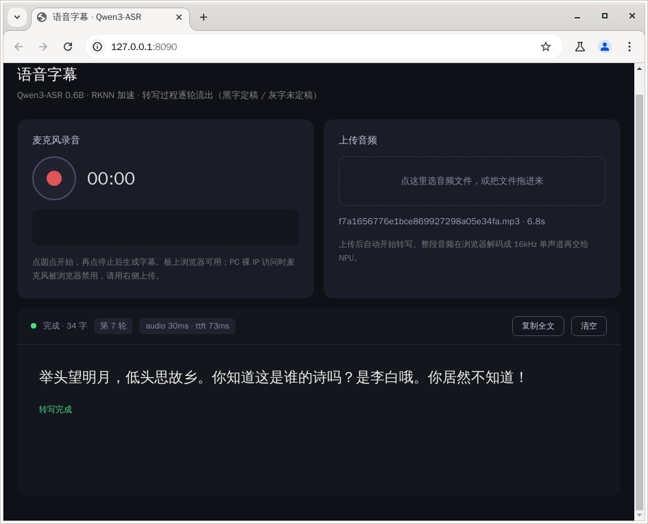

[← 返回总览](../README.md) · [English](README_EN.md)

# 📝 Qwen3-ASR 语音字幕

对着麦克风说一段话，停止后**字幕像打字一样逐轮流出来**：已经确定的句子是黑色正文、固定不动越来越长；正在识别的那半句先用灰色草稿显示，随语音不断修正、改准了才「转正」变黑。也可以上传音频文件（wav/mp3/flac/m4a…），效果相同。



整条管线在 NPU 上跑：音频编码器 + Qwen3-0.6B 语言模型（8 核 core_mask）。网页壳把官方 `rknn_qwen3_asr_demo_online` 二进制的逐轮输出（`commit_add_text` / `unfix_text`）解析成 SSE 事件推给浏览器，**二进制和运行库直接用官方包里的，板上零编译**。

## 准备

- 本目录自带官方 demo 包的运行件：`rknn_qwen3_asr_demo_online`（二进制）、`lib/`（librknn3_api 等）、`mel_128_filters.txt`（特征滤波器，必须在运行目录下）
- 模型放 `model/` 子目录（运行本目录下的 `deploy.sh` 一键拉取、校验）：6 个文件约 2.4GB

| 东西 | 板子上的位置 |
|---|---|
| 模型（6 个：encoder_online 和 llm 的 rknn+weight，tokenizer.gguf，embed.bin） | `<demo 目录>/model/` |

**网络**：deploy 阶段要从 GitHub Releases 下载约 2.4GB，板子得能上网；走代理的话先设好再跑（地址和端口换成自己的）：

```bash
export http_proxy=http://<代理地址>:<你的端口> https_proxy=http://<代理地址>:<你的端口>
```

## 跑起来

```bash
# 1) 拿代码（GitHub / Gitee 二选一；板子上已有仓库就 git pull）
git clone https://github.com/ShiMetaPi/rk1828-modelhub.git
# git clone https://gitee.com/ShiMetaPi_0/rk1828-modelhub.git   # 国内快

# 2) 拉模型（约 2.4GB；断点续传 + MD5 校验，中断了重跑接着下；板上零编译）
cd rk1828-modelhub/asr
sh deploy.sh

# 3) 启动
sh start.sh
```

运行后板子浏览器自动打开页面。从电脑访问：同网段直接开 **http://<板子IP>:8090**；点对点直连先在电脑上转发端口，再开 `http://127.0.0.1:<你的端口>`：

```bash
ssh -L <你的端口>:127.0.0.1:8090 root@<板子IP>
```

### 板子下载慢？在电脑上先下好

用浏览器打开 [models-asr Release](https://github.com/ShiMetaPi/rk1828-modelhub/releases/tag/models-asr) 把 6 个模型文件全部下载，拷进板子 demo 的 `model/`：

```bash
scp encoder_online.* llm.* root@<板子IP>:<仓库路径>/asr/model/
```

放好后照样跑 `sh deploy.sh`：已就位且 MD5 正确的文件直接跳过下载。

- **麦克风录音**：点红圆点开始（实时波形 + 计时），再点停止 → 自动解码提交 → 字幕流出。需要浏览器安全上下文：板上 chromium（127.0.0.1）没问题；从 PC 用裸 IP 访问时麦克风被禁，用上传模式
- **上传音频**：点虚线框或把文件拖进去（wav / mp3 / flac / ogg / m4a，浏览器里解码成 16kHz 单声道再提交）

## 转写速度

实测（15 秒英文测试音频，16 轮）：每轮芯片级 **audio ~33ms · ttft ~70ms**，整段几秒出完；首轮前要加载模型——**冷启动约 1 分钟，之后约 15 秒**（权重留在 page cache）。单段音频上限 17 分钟。

## 模型什么时候加载？

跟其他 demo 一个逻辑：页面开着服务才活着（每 5s 心跳保活，多标签页互不影响）；**页面全部关闭 → 释放 NPU、宽限 10 秒后服务自动退出**，重跑 `start.sh` 即可（幂等）。NPU 被别的 demo 占着时会明确报错，关掉那个 demo 再来。手动停：重跑 `start.sh` 自动停旧实例，或 `curl 127.0.0.1:8090/api/bye`。同一时刻只跑一个转写任务（NPU 独占）。

<details>
<summary><b>出问题了看哪里</b></summary>

| 现象 | 在板子上看 |
|---|---|
| 页面打不开 | `pgrep -af asr_engine.py`，`curl 127.0.0.1:8090/api/status` |
| 一直「加载模型」 | 冷启动约 1 分钟，等一等；服务日志 `tail /tmp/asr_start.log` |
| 点按钮没反应 / 提示「服务已退出」 | 页面曾全部关闭过。页面开着时每 5s 心跳保活不会退；重跑 `sh start.sh` 后刷新页面 |
| 提示 NPU 被占用 | 其他 demo 页面还开着，关掉它再提交 |
| 上传后提示解码失败 | 换常见格式（wav/mp3）；m4a/ogg 取决于浏览器解码器 |
| 转写结果是空的 | 音频太短或没人声；录长一点（≥3 秒清晰人声） |

</details>
