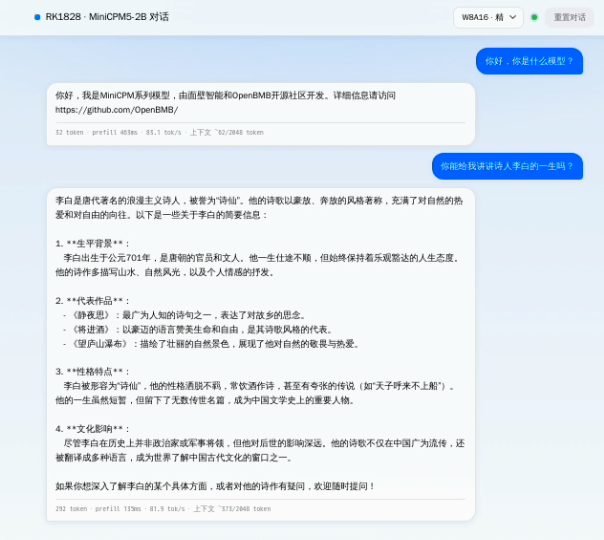

[← 返回总览](../README.md)

# 💬 MiniCPM5-2B 聊天 Demo

跑在板子上的浏览器聊天界面：流式输出、多轮对话，上下文快满时自动把旧对话压成一段摘要接着聊（页面上会有提示条），右上角下拉可以在 W4A16 和 W8A16 之间切换。



## 准备

- 板子系统里要有 `rkllm3-server`；`start.sh` 会自动探测，缺了会告诉你
- 模型和聊天模板由本目录下的 `deploy.sh` 一键拉取、校验，放到默认位置：

| 东西 | 板子上的位置 |
|---|---|
| W4 模型（四个文件：rknn / weight / embed.bin / tokenizer.gguf） | `<demo 目录>/model/w4/` |
| W8 模型（rknn / weight，词表和 embed 跟 W4 共用） | `<demo 目录>/model/w8/` |
| 聊天模板 minicpm5.jinja（仓库里就有，deploy 顺手放好） | `<demo 目录>/model/` |

**网络**：deploy 阶段要从 GitHub Releases 下载约 4.4GB 模型，板子得能上网；走代理的话先设好再跑（地址和端口换成自己的）：

```bash
export http_proxy=http://<代理地址>:<你的端口> https_proxy=http://<代理地址>:<你的端口>
```

## 跑起来

```bash
# 1) 拿代码（GitHub / Gitee 二选一；板子上已有仓库就 git pull）
git clone https://github.com/ShiMetaPi/rk1828-modelhub.git
# git clone https://gitee.com/ShiMetaPi_0/rk1828-modelhub.git   # 国内快

# 2) 拉模型（约 4.4GB；断点续传 + MD5 校验，中断了重跑接着下）
cd rk1828-modelhub/chat
sh deploy.sh

# 3) 启动（这时只起了网页壳，还没加载模型）
sh start.sh
```

运行后板子浏览器自动打开页面（约 2 秒），模型在页面打开后才开始加载，等十几秒就能聊了。从电脑访问：板子和电脑同网段就直接开 **http://<板子IP>:8089**；点对点直连的话先在电脑上转发端口，再开 `http://127.0.0.1:<你的端口>`：

```bash
ssh -L <你的端口>:127.0.0.1:8089 root@<板子IP>
```

### 板子下载慢？在电脑上先下好

用浏览器打开 [models-chat Release](https://github.com/ShiMetaPi/rk1828-modelhub/releases/tag/models-chat) 把 6 个模型文件全部下载，拷进板子 demo 的 `model/`。注意 W8 的两个文件放进 `model/w8/` 时要**改名去掉 `-w8`**：

| 下载的文件 | 放到板子哪里 |
|---|---|
| MiniCPM5-2B.rknn / .weight / .embed.bin / .tokenizer.gguf | `chat/model/w4/`（名字不变） |
| MiniCPM5-2B-w8.rknn / MiniCPM5-2B-w8.weight | `chat/model/w8/`，改名为 MiniCPM5-2B.rknn / MiniCPM5-2B.weight |

```bash
scp MiniCPM5-2B.* root@<板子IP>:<仓库路径>/chat/model/w4/
```

超过 2GB 的文件在 Release 上是分片（`xxx.part-aa`、`xxx.part-ab`…），要把分片下齐、在电脑上拼回原文件再传：Windows `copy /b xxx.part-aa+xxx.part-ab xxx`，Linux/mac `cat xxx.part-* > xxx`。放好后照样跑 `sh deploy.sh`：已就位且 MD5 正确的文件直接跳过下载。

## 模型什么时候加载？

模型不常驻，跟着网页走：页面开着模型就一直在；**页面一关 NPU 马上释放，宽限 10 秒（防刷新误杀）后整个服务自动退出**，重新运行 `start.sh` 即可（幂等，不会端口冲突）。就算浏览器直接崩了没发通知，板子也会在 75 秒后自己把模型释放掉、300 秒后退出服务。

几个实际效果：

- 想换到视频问答 demo？关掉这个标签页、开那个就行
- 如果页面提示"NPU 已被其他 demo 占用"，说明另一个 demo 的页面还开着——关掉它，这边会自动重试，不用手动干预
- 右上角切换 W4/W8：先释放旧模型再加载新的，大概 30~60 秒，对话会清空

## 停掉

```bash
sh <demo 目录>/start.sh stop
```

<details>
<summary><b>出问题了看哪里</b></summary>

| 现象 | 在板子上看 |
|---|---|
| 页面提示 rkllm3-server 拉不起来 | `tail /tmp/rkllm3-server.log` |
| 页面没反应 | `pgrep -af rkllm3-server`，`curl 127.0.0.1:8081/v1/models` |
| 网页壳本身的日志 | `tail /tmp/chat_web.log` |

</details>
