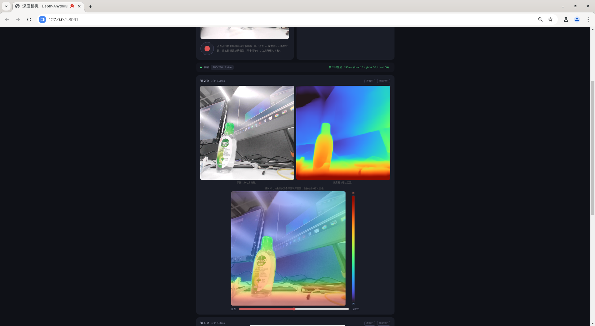

[← 返回总览](../README.md)

# 📏 深度相机


网页里看摄像头画面，点一下拍摄键，**出一张原图 + 一张深度图**：离得近的东西偏红、远的偏蓝。拍完还能拖滑块把原图和深度图叠在一起看，旁边一根热成像式的色条对照远近。没摄像头也能玩——上传任意 JPG/PNG，同样出深度图。



模型是 Depth-Anything-V3-Base，官方拆成三个子模型接力跑，全部在 NPU 上：`local`（每张图独立提特征 token）→ `global`（跨 view 建模）→ `head`（出深度图）。引擎把官方 rknn3-model-zoo 的管线完整移植成常驻 C++ 进程，三个模型**共享一块 NPU 内部内存**，比各开各的省不少显存。

**输出是相对深度**：只保证「谁近谁远、近多少」的关系正确，不保证绝对米数（DA3-BASE 就是不吃相机内参的相对深度模型，页面上的数值不带米制含义）。要真·米制深度得换带内参输入的 metric 变体，另说。

## 准备

- 模型放 `model/` 子目录（运行本目录下的 `deploy.sh` 一键拉取、校验）：6 个文件约 **1.1GB**

| 东西 | 板子上的位置 |
|---|---|
| 模型（6 个：local / global / head 的 rknn+weight） | `<demo 目录>/model/` |
| USB 摄像头（可选） | UVC 协议即可；没有就用上传图片模式 |

## 跑起来

```bash
# 传到板子
ssh root@<板子IP> "mkdir -p /root/depth_demo"
scp -r depth/* root@<板子IP>:/root/depth_demo/

# 拉模型（在板上，约 1.1GB；断点续传 + MD5 校验，可重复跑）
ssh root@<板子IP> "GITHUB_REPO=ShiMetaPi/rk1828-modelhub sh /root/depth_demo/deploy.sh"

# 启动（首次会自动编译 C++ 引擎，约几十秒）
ssh root@<板子IP> "sh /root/depth_demo/start.sh"
```

运行后板子浏览器自动打开页面；也可手动开 **http://<板子IP>:8091**。

- **拍摄**：取景框是方形（模型输入就是方形，所见即所得），点红圆点出「原图 vs 深度图」+ 叠加对比
- **上传**：点虚线框或拖图进去，自动取画面中央的方形区域，效果相同

## 速度

实测：首次打开页面后台加载模型约 **7~10 秒**（取景的功夫就加载完了，拍摄时不用等）；之后**每张约 0.2 秒**——芯片级 pre ~15ms · local ~18ms · global ~52ms · head ~52ms · 上色 ~36ms。模型常驻 NPU 占用约 **1.2GB / 5GB**。

## 模型什么时候加载？

跟其他 demo 一个逻辑：页面开着服务才活着（每 5s 心跳保活，多标签页互不影响）；**页面全部关闭 → 释放 NPU、宽限 10 秒后服务自动退出**，重跑 `start.sh` 即可（幂等）。NPU 被别的 demo 占着时会明确报错，关掉那个 demo 再来。同一时刻只处理一张图（NPU 独占）。

<details>
<summary><b>出问题了看哪里</b></summary>

| 现象 | 在板子上看 |
|---|---|
| 页面打不开 | `pgrep -af depth_engine.py`，`curl 127.0.0.1:8091/api/status` |
| 一直「模型加载中」 | 首次 7~10 秒，等一等；日志 `tail /tmp/depth_start.log`、引擎日志 `tail /tmp/depth_engine.stdout` |
| 摄像头打开失败 | USB 摄像头没插好（`lsusb`）；或浏览器比摄像头先启动了——插好后刷新页面 |
| 第一张特别慢 | 那是在加载模型（约十几秒），之后每张约 0.2 秒 |
| 提示 NPU 被占用 | 其他 demo 页面还开着，关掉它再拍 |
| 提示「服务已退出」 | 页面曾全部关闭过。重跑 `sh start.sh` 后刷新页面 |

</details>

<details>
<summary><b>一些实现细节</b></summary>

- 三段管线移植自官方 rknn3-model-zoo `depth_anything_v3`，量化 w16a16、8 核；`user_mem_internal=1` 让三个子模型共享一块 NPU 内部内存（取各核需求最大值分配，一套绑定三模型）
- 模型导出时固定了 view 数 V（本套 V=1，从 global 输入 shape 读出）。单图 demo 里 local 只跑一次，token 直接复制进 V 个槽位——同输入同输出，不重复算
- 上色逻辑照抄官方：深度 → 逆深度 → 取 2%~98% 分位裁剪 → turbo 色表。页面色条用**同一组 turbo 多项式**在前端生成，颜色和深度图严格一致
- DA3-BASE 是相对深度模型：不接收相机内参，输出无米制量纲，所以页面不标「米」（README 顶部的性能数字同理只看相对关系）
- 浏览器端做中心方裁剪（模型输入固定 280×280 方形），原图和深度图同构图不变形
- 引擎是常驻 C++ 进程（Unix socket 行 JSON 协议：ping / load / infer），Python 网页壳只管 HTTP 和生命周期——和 vl / tts demo 同款架构

</details>
