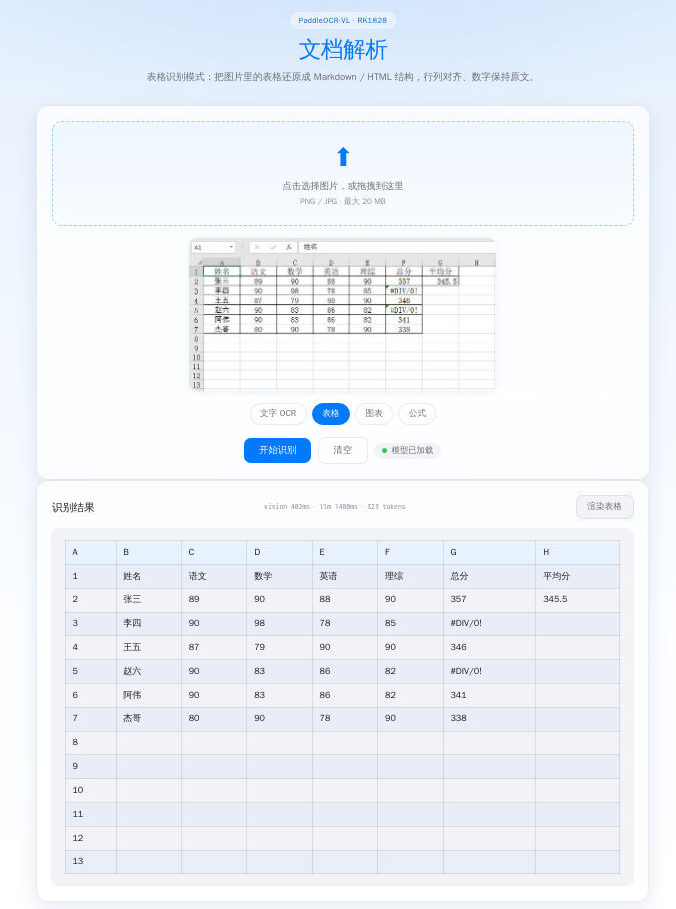
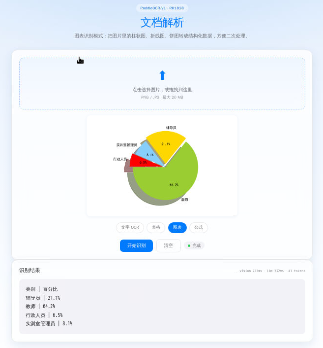
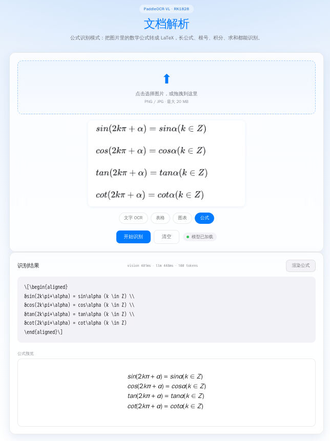

[← Back](../README_EN.md) · [中文](README.md)

# 📄 Document Parsing

Upload an image and switch among **four modes — text / table / chart / formula — in one click**: text OCR extracts plain text, table restores the row/column structure, chart (bar / line / pie, etc.) turns into structured data, formula converts to LaTeX. Built on PaddleOCR-VL (Baidu's open-source multimodal vision-language model), running on the RK1828 NPU.

<table>
<tr>
<td width="25%" align="center" valign="top">

**Text OCR** · extract text


</td>
<td width="25%" align="center" valign="top">

**Table** · restore structure



</td>
<td width="25%" align="center" valign="top">

**Chart** · structured data



</td>
<td width="25%" align="center" valign="top">

**Formula** · LaTeX



</td>
</tr>
</table>

| Port | Engine | Model |
|---|---|---|
| 8093 | C++ ocr_engine (Unix socket + stb_image + official submodules) | PaddleOCR-VL (504×504 vision + 4-bit LLM) |

## Quick Start

```sh
cd paddleocr_vl
sh deploy.sh     # pull SDK + models + build engine
sh start.sh      # start service (NPU check + ocr_server.py + browser)
```

Open `http://localhost:8093/` (or `http://<board-ip>:8093/`), drop in or upload an image, and click "Recognize".

`stop.sh` force-stops (kills the Python web layer + the C++ engine subprocess).

## Architecture (three layers, identical to vl/tts/asr/depth/yolo26)

```
browser (ocr.html)
    ↑ SSE token stream
    ↓ POST /api/ocr (multipart image upload)
Python web (ocr_server.py :8093)
    ↓ start / stop / probe
C++ engine (ocr_engine /tmp/ocr_engine.sock)
    ↓ init_paddleocr_vl_model / inference_paddleocr_vl_model
RKNN3 NPU (vision 504² + mlpar + 4-bit LLM)
```

- **Page-driven lifecycle**: opening the page (GET /) triggers a background preload (model init on first request). Closing / backgrounding the page → POST /api/bye → engine unloads, NPU released.
- **NPU is exclusive**: start.sh runs `rknn-smi` first and refuses if it's occupied.
- **Model stays warm**: after the first inference the model stays resident ~75 s idle before unloading.

## Models

9 files, ~795 MB, under `<demo>/{llm,vision}/` (unlike other demos it doesn't use `model/`; PaddleOCR-VL keeps the rknn3-model-zoo upstream layout of `llm/` + `vision/`):

| Subdir | Files |
|---|---|
| llm/  | PaddleOCR-llm.{rknn, weight, tokenizer.gguf, embed.bin} |
| vision/ | PaddleOCR-vision.{rknn, weight} |
| vision/ | PaddleOCR-vision-mlp_AR.{rknn, weight} (MLP-AR subgraph) |
| vision/ | position_embedding_model.bin |

Vision input is 504×504 (fixed in `engine/src/vision/rknn_paddleocr_vl_vision.h`). The model directory keeps the rknn3-model-zoo upstream layout (llm/ + vision/); the four modes (text / table / chart / formula) are switched by the frontend prompt.

## deploy.sh: two ways to pull models

Tried in order:

1. **GitHub Release** (tag `models-paddleocr-vl`) — public repo `ShiMetaPi/rk1828-modelhub`, verified with `curl + md5sum`. Set `MIRROR_URL=...` to switch to a local mirror for speed.
2. **Local llm/ + vision/ already present** — if GitHub is unreachable (Release not published or offline), the script scans `<here>/{llm,vision}/`: files with correct MD5 are skipped, others error with two remedies:
   - publish the Release, or
   - `rsync` from a PC: `rsync -avP <pc_paddleocr_vl>/{llm,vision}/ <board>:<here>/{llm,vision}/`

`librknn3_api.so` is pulled from tag `rknn3-api`, shared with the other demos.

## Engine C++ layout

```
engine/
├── CMakeLists.txt           # links librknn3_api + tokenizers-cpp + stb_image
├── build.sh                 # on-board build entry (called by deploy.sh)
├── sdk/rknn3_api.h          # RKNN3 header (copied from vl)
├── src/
│   ├── main.cpp             # our Unix-socket server: socket wrapper over init_/infer_/release_
│   ├── paddleocr_vl.cc/h    # official orchestration (init/inference/release + shared internal memory)
│   ├── llm/                 # official LLM submodule
│   ├── vision/              # official vision submodule (MODEL_WIDTH/HEIGHT=504 fixed)
│   └── mlpar/               # official MLP-AR submodule (dynamic shape, forced to CPU)
├── 3rdparty/
│   ├── stb/                 # stb_image.h + stb_image_write.h (single-header)
│   └── tokenizer/           # libtokenizer.a + Tokenizer.h (llama.cpp-backed)
```

**Socket protocol** (single-line JSON, `\n`-delimited):

```
{"cmd":"ping"}
  → {"ev":"pong","loaded":1}
{"cmd":"load","qid":N}
  → {"ev":"done","qid":N,"loaded":1,"load_ms":12345} (or {"ev":"error","msg":...})
{"cmd":"infer","qid":N,"img":"/path/to/img.png","prompt":"ocr|table|chart|formula"}
  → multiple lines:
    {"ev":"token","qid":N,"text":"<fcel>考评项目"}
    {"ev":"token","qid":N,"text":"<lcel><fcel>权重"}
    ...
    {"ev":"done","qid":N,"tokens":418,"vision_ms":507,"llm_ms":1743,"total_ms":2400}
{"cmd":"unload","qid":N}
  → {"ev":"done","qid":N,"loaded":0}
```

## Current limitations / next steps

- Chart-mode output is the same Markdown pipe table as table mode, but the frontend only wired rendering to the "table" mode for now — chart results currently display as plain text.
- The model is not yet on GitHub Release (v1 stage); first deploy needs a manual rsync.
- Performance: per the README, vision ~507 ms + LLM decode ~240 tok/s; results within 1–2 s are typical.

## Known pitfalls / notes

- The C++ engine holds ~800 MB of NPU memory after loading and is **mutually exclusive** with other demos; start.sh self-checks with `rknn-smi` before starting.
- `position_embedding_model.bin` is model-specific (3.2 MB); don't reuse a same-named file from another demo.
- The mlpar subgraph must run on the CPU (dynamic shape); the NPU only runs the vision encoding + LLM decode.
