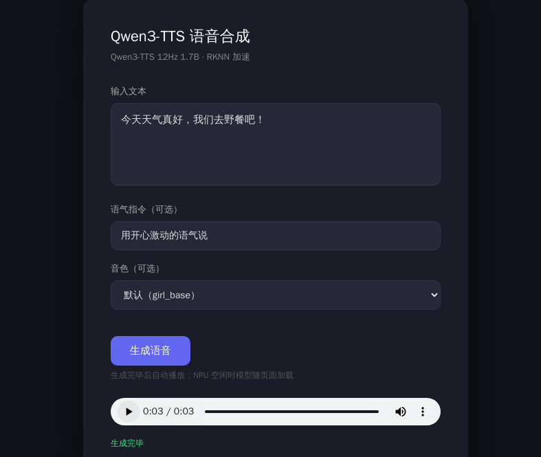

[← 返回总览](../README.md)

# 🔊 Qwen3-TTS 语音合成 Demo


输入一段文字，浏览器里点一下就能听合成语音。还能用一句自然语言控制语气（「用开心激动的语气说」「用悲伤带哭腔的语气说」），切换 9 个预置音色（含四川话、北京话），以及**用自己的声音合成**——给一段 5~10 秒的参考录音，就能克隆出同名音色。



核心是一条 4 模型管线（全部在 NPU 上跑）：`text_projector → talker → code_predictor → speech_decoder`，最后输出 24kHz 单声道 WAV。talker 是 1.7B CustomVoice，支持 instruction 控制。

## 准备

- 板子上要有 RKNN3 运行库 `librknn3_api.so`（`/usr/lib` 下）和头文件 `rknn3_api.h`（随 chat/vl demo 的 SDK 一起装）；首次跑 `start.sh` 会现编译 C++ 引擎，缺什么它会告诉你
- 模型放到 `/userdata/models/qwen3-tts/`（运行本目录下的 `deploy.sh` 一键拉取、校验、放到默认位置）：12 个文件**平铺在同一目录**（引擎按文件名读取，没有子目录）

| 东西 | 板子上的位置 |
|---|---|
| 模型（12 个：talker / code_predictor / speech_decoder / text_projection 的 rknn+weight，tokenizer.json，3 个 embed） | `/userdata/models/qwen3-tts/` |

## 跑起来

```bash
# 传到板子
ssh root@<板子IP> "mkdir -p /root/tts_demo"
scp -r tts/* root@<板子IP>:/root/tts_demo/

# 拉模型（在板上，约 4GB；断点续传 + MD5 校验，可重复跑）
ssh root@<板子IP> "GITHUB_REPO=ShiMetaPi/rk1828-modelhub sh /root/tts_demo/deploy.sh"

# 启动（只起网页壳，模型等页面打开才加载）
ssh root@<板子IP> "sh /root/tts_demo/start.sh"
```

运行后板子浏览器自动打开页面（约 2 秒）；也可手动开 **http://<板子IP>:8088**。输入文字（可选填「语气指令」、选「音色」），点「生成语音」即可。

## 模型什么时候加载？

跟聊天/视频 demo 一个逻辑：页面开着引擎才跑；**页面关掉立即释放 NPU，宽限 10 秒（防刷新误杀）后整个服务自动退出**，重新运行 `start.sh` 即可（幂等，不会 address already in use）。NPU 被别的 demo 占着时引擎不会硬上，接口会报错，关掉那个 demo 再刷新即可。手动停：`sh start.sh` 重跑会自动停旧实例，或 `curl 127.0.0.1:8088/api/bye`。

## 合成速度

「你好」约 1.4s，「欢迎使用语音合成」约 1.9s，15 字句约 3.8s。语气指令会改变韵律（悲伤比开心明显更慢）。

## 声音模仿（克隆自己的声音）

原理：参考音频 → 2048 维说话人向量（8KB `.npy`）→ 板上 talker 注入合成。**提取全程在板上完成**：网页里选音频文件或直接录音，浏览器解码重采样成 24kHz PCM 传给引擎，`spk_encoder.cc` 在 NPU 上跑说话人编码器（12M 参数 ECAPA）出向量、直接落 `voices/`，不用重启、不用 PC 参与。

```bash
# 0)（一次性）把说话人编码器转成 RKNN —— 见 tools/HANDOFF_export.md：
#    服务器跑 tools/export_spk_encoder.py 出 ONNX + mel 滤波器组 + 金标准，
#    再走现有 RKNN 转换流程出 spk_embed.rknn + spk_embed.weight，拷到模型目录
#    （缺这步不影响合成，只是网页「提取音色」会提示不可用）

# 1) 打开 http://<板子IP>:8088 → 「声音模仿」区：选一段音频或点「录音」，填音色名，点「提取音色」

# 2) 音色下拉里选新音色，正常输入文本生成即可
```

- 参考音频要求：**5~10 秒干净人声**（单人、无 BGM、无混响），最短 3 秒；引擎固定取前 10 秒——**录满 10 秒相似度最好**（短音频会被补零，稀释音色向量）
- 板端提取实测：向量提取 0.11s；金标准对拍 cosine 0.9993（板端 C++ 预处理 + NPU 推理 vs 服务器 PyTorch 真值）
- `spk_embed.rknn` / `spk_embed.weight` / `spk_mel_128x513.f32` 已进 deploy.sh 的 Release 自动下载清单；要自己重新转换编码器则看 `tools/HANDOFF_export.md`
- 编码器是官方 Qwen3-TTS 12Hz 1.7B-Base 里的说话人编码器（社区导出 `marksverdhei/Qwen3-Voice-Embedding-12Hz-1.7B`，ECAPA 12M 参数，Apache-2.0）；板上预处理（STFT + mel 滤波器组）与 transformers 侧逐位对齐，mel 矩阵从 `spk_mel_128x513.f32` 数据文件加载，不在 C++ 里复刻公式
- 录音需要浏览器安全上下文：板上 chromium（127.0.0.1）没问题；从 PC 用裸 IP 访问时 getUserMedia 会被禁，此时用「选音频文件」即可
- 手动路径也保留：PC 上 `tools/extract_spk_embed.py` 出 `.npy` → 网页上传或 `scp` 进 `voices/`，与板端提取完全等价
- 名字限小写字母/数字/`_`/`-`，1~24 位；文件校验（恰好 2048 个 float32），非法文件/名字会拦

<details>
<summary><b>出问题了看哪里</b></summary>

| 现象 | 在板子上看 |
|---|---|
| 页面打不开 | `pgrep -af tts_engine.py`，`curl 127.0.0.1:8088/api/status` |
| 一直「加载中」 | 模型加载约 40s，等一等；引擎日志 `tail /tmp/tts_engine.stdout` |
| 点按钮没反应 / 提示「服务已退出」 | 服务退出过（页面曾全部关闭）。页面开着时每 5s 心跳保活、不会退；重跑 `sh start.sh` 后刷新页面即可 |
| 生成报错 | `/tmp/tts_engine.stdout`（C++ 引擎）和网页壳日志 |
| 中文乱码 | 别用 Windows 本地 curl 直接发中文（控制台编码问题），走浏览器或板上 curl |

</details>

<details>
<summary><b>一些已知行为</b></summary>

- 页面驱动生命周期：页面开着每 5s 心跳保活（多开标签页互不影响，关掉其中一个不会误杀）；页面全部关闭 → 释放 NPU、10s 后服务退出，重跑 start.sh 即可
- 语气指令走的是 talker 的 instruct 通道（`<|im_start|>user\n{指令}<|im_end|>` 拼在 prefill 最前），只在 1.7B CustomVoice 上有效
- 音色三组：9 个预置（spk_id 表）、内置克隆向量（girl_base 默认 / ahu）、上传的自定义克隆（`voices/*.npy`，运行时加载）；不选则默认 girl_base
- 输出 `/tmp/tts_out_<qid>.wav`，RIFF WAVE PCM16 mono 24000Hz

</details>
