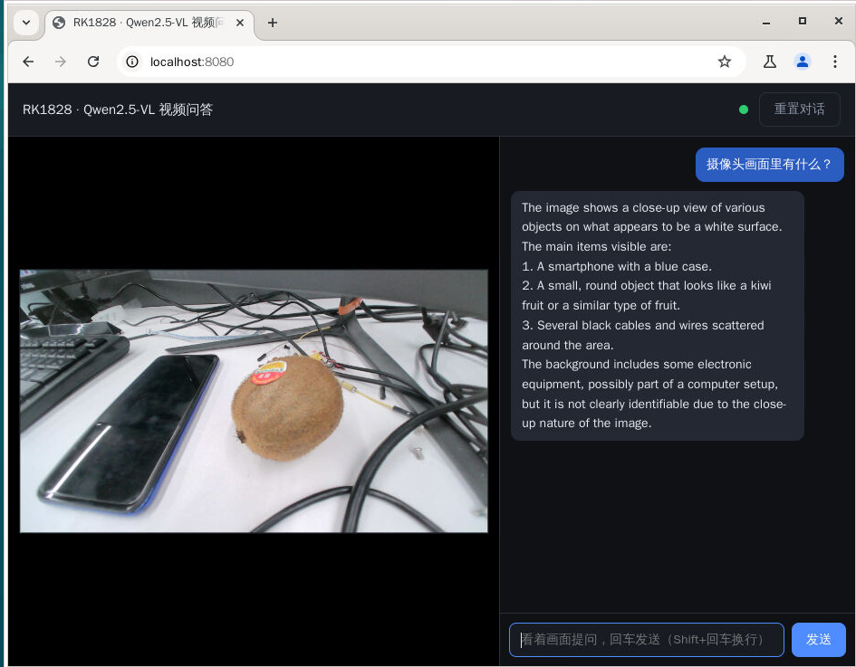

[← 返回总览](../README.md)

# 📷 Qwen2.5-VL-3B 视频问答 Demo


接一个 USB 摄像头，浏览器里看实时画面，对着画面打字提问，回答流式蹦出来。



核心是个 C++ 写的引擎（`engine/` 目录，编译出来叫 `vl_engine`），它负责摄像头采集、图像预处理、在 NPU 上跑视觉模型和多模态对话模型，再把结果流式吐给网页。

## 准备

- 板子上有 `g++` 和 libjpeg 开发头文件，缺就 `apt install -y g++ libjpeg-dev`
- 一个 UVC USB 摄像头（支持 MJPG 1080p 就行，自动识别 `/dev/video*`，倒着装也没关系，页面会翻正）
- 模型放到 `/userdata/models/qwen2.5-vl-3b/`（怎么放见仓库 [models/](../models/README.md) 的说明）：`model/` 下六个模型文件，`lib/` 下是运行库（编译和运行都从这里找）

## 跑起来

```bash
# 传到板子
ssh root@<板子IP> "mkdir -p /root/vl_demo"
scp -r vl/* root@<板子IP>:/root/vl_demo/

# 编译引擎（一分钟左右）
ssh root@<板子IP> "cd /root/vl_demo && sh build.sh"

# 启动（只起网页和守护，引擎等页面打开才加载）
ssh root@<板子IP> "sh /root/vl_demo/start.sh"
```

浏览器打开 **http://<板子IP>:8080**，等右上角状态点变绿（约 20 秒），画面出来就能提问了。

## 引擎什么时候加载？

跟聊天 demo 一个逻辑：页面开着引擎才跑，页面关掉 75 秒后引擎自动退出、NPU 释放。NPU 被别的 demo 占着时引擎不会硬上，页面顶部会提示先关掉那个，关了自动重试。手动停：`sh start.sh stop`。

## 性能

问一句 1 秒内出答案；视觉编码一帧约 250ms，回答速度 44~46 token/s。NPU 占 2.3G 左右且多轮推理期间不增长；另外引擎要在系统内存里放 embed 表，会吃掉 0.7G 左右。详细数据见 [bench/perf.md](../bench/perf.md)。

<details>
<summary><b>出问题了看哪里</b></summary>

| 现象 | 在板子上看 |
|---|---|
| 一直没画面 | `tail /tmp/vl_engine.log`（采集用的哪个 /dev/video）；摄像头换个 USB 口试试 |
| 引擎一直不加载 | 页面顶部横幅（多半是 NPU 被占了），或 `tail /tmp/vl_watch.log` |
| 回答报错 | `/tmp/vl_engine.log` 和 `/tmp/vl_web.log` |

</details>
