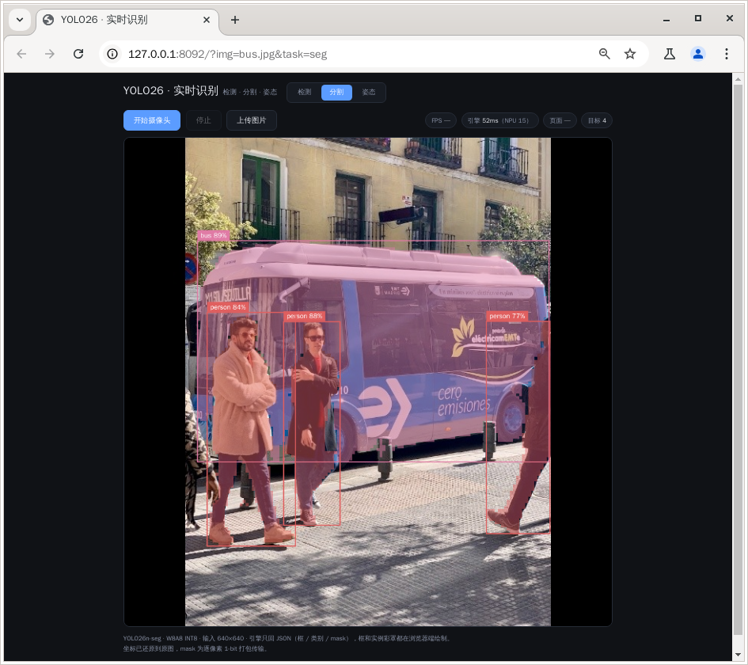
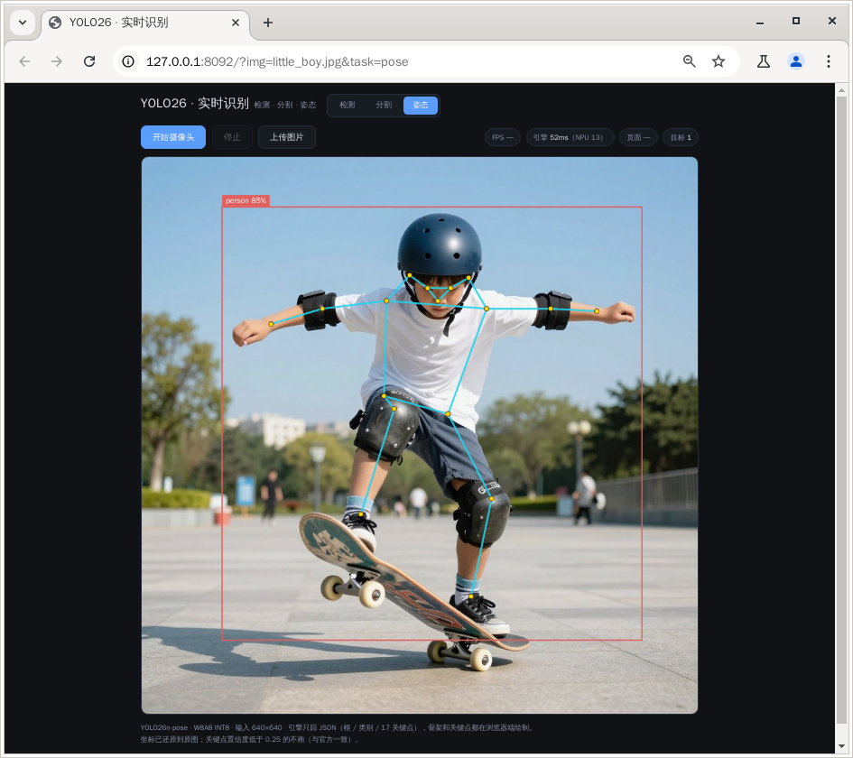

[← 返回总览](../README.md)

# 🎯 YOLO26 实时识别

网页里开摄像头实时识别，**检测 / 分割 / 姿态三个页签一键切换**：检测出框 + 类别，分割再叠逐像素实例彩罩，姿态画 17 关键点骨架。切换时引擎换模型约 0.3 秒——摄像头模式自动续流，传图模式直接用新模型重推当前图。也能上传任意图片做单帧。

<table>
<tr>
<td width="33%" align="center" valign="top">

**检测** —— 框 + 类别


</td>
<td width="33%" align="center" valign="top">

**分割** —— 框 + 实例彩罩



</td>
<td width="33%" align="center" valign="top">

**姿态** —— 17 关键点骨架



</td>
</tr>
</table>

模型是 YOLO26n det / seg / pose 三兄弟（COCO 80 类），都是 W8A8 INT8 量化、输入 640×640。引擎把官方 rknn3-model-zoo `yolo26` / `yolo26_segment` / `yolo26_pose` 三个示例的 W8A8 后处理完整移植成一个常驻 C++ 进程：直接回归框（无 DFL）、score 名带 sigmoid 天然在概率域、mask 用 coeff×proto **整数点积**——全程不反量化、不浮点。

实时画面用**冻结帧**方案：画布显示的永远是「正在被分析的那一帧」，mask 和画面严格对齐、人再快也不拖影（代价是画面节奏 ≈ 推理帧率，不追直播流畅度）。

## 准备

- 模型放 `model/` 子目录（运行本目录下的 `deploy.sh` 一键拉取、校验）：6 个文件共约 **11.5MB**

| 东西 | 板子上的位置 |
|---|---|
| 模型（yolo26n det / seg / pose 各一对 rknn + weight） | `<demo 目录>/model/` |
| USB 摄像头（可选） | UVC 协议即可；没有就用上传图片模式 |

## 跑起来

```bash
# 传到板子
ssh root@<板子IP> "mkdir -p /root/yolo26_demo"
scp -r yolo26/* root@<板子IP>:/root/yolo26_demo/

# 拉模型（在板上，共约 11.5MB；断点续传 + MD5 校验，可重复跑）
ssh root@<板子IP> "GITHUB_REPO=ShiMetaPi/rk1828-modelhub sh /root/yolo26_demo/deploy.sh"

# 启动（首次会自动编译 C++ 引擎，约几十秒）
ssh root@<板子IP> "sh /root/yolo26_demo/start.sh"
```

运行后板子浏览器自动打开页面；也可手动开 **http://<板子IP>:8092**。

- **实时**：点「开始摄像头」，画面上直接出框和彩罩，右上角看 FPS / 引擎耗时 / 页面耗时
- **切换任务**：点「检测 / 分割 / 姿态」页签，引擎换模型约 0.3 秒；摄像头模式停帧再续流，传图模式自动重推当前图
- **上传**：点上传按钮选一张图，单帧识别，效果相同

## 模型什么时候加载？

跟其他 demo 一个逻辑：页面开着服务才活着（每 5s 心跳保活，多标签页互不影响）；**页面全部关闭 → 释放 NPU、宽限 10 秒后服务自动退出**，重跑 `start.sh` 即可（幂等）。NPU 被别的 demo 占着时会明确报错，关掉那个 demo 再来。同一时刻只处理一帧（NPU 独占，忙时丢帧不排队）。

<details>
<summary><b>出问题了看哪里</b></summary>

| 现象 | 在板子上看 |
|---|---|
| 页面打不开 | `pgrep -af yolo26_server.py`，`curl 127.0.0.1:8092/api/status` |
| 一直「模型加载中」 | 正常 <1 秒；日志 `tail /tmp/yolo26_start.log`、引擎日志 `tail /tmp/yolo26_engine.stdout` |
| 摄像头打开失败 | USB 摄像头没插好（`lsusb`）；或浏览器比摄像头先启动了——插好后刷新页面 |
| FPS 明显低于 14 | 看右上角「页面」耗时：大说明后台有东西抢 CPU；「引擎」大说明 NPU 被干扰 |
| 提示 NPU 被占用 | 其他 demo 页面还开着，关掉它再开 |
| 提示「服务已退出」 | 页面曾全部关闭过。重跑 `sh start.sh` 后刷新页面 |

</details>
